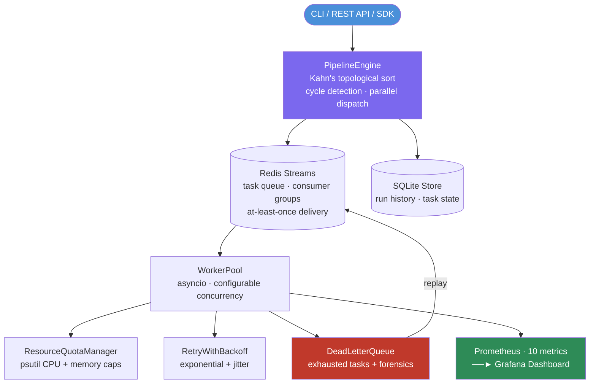

# Conduit — Event-Driven ML Pipeline Orchestrator

Lightweight DAG-based pipeline orchestrator using Redis Streams. Airflow without the weight. Built for Apple Silicon. $0 budget. Fully local.

---

## What it does

Conduit lets you define ML workflows as Python DAGs using a decorator DSL, then executes them reliably using a Redis Streams task queue. It handles dependency resolution, parallel dispatch, retries with backoff, resource quotas, and dead letter queues — giving you Airflow-style orchestration without the operational overhead.

---

## Why it matters

ML pipelines have hard requirements: task ordering, retries on transient failures, forensics on permanent failures, and resource guards to prevent OOM. Conduit implements these patterns from scratch using Redis Streams as the backbone — the same event-driven architecture used in production streaming systems. It's a practical demonstration of DAG scheduling and at-least-once delivery semantics.

---

## Architecture



---

## Features

- **Python DAG DSL**: `@conduit.task` and `@conduit.dag` decorators; task graph built from Python functions
- **Dependency resolver**: Kahn's algorithm — topological sort with cycle detection
- **Parallel dispatch**: independent tasks in a stage run concurrently
- **Redis Streams task queue**: at-least-once delivery, consumer groups, acknowledgement
- **Retries with exponential backoff + jitter**: configurable per-task max retries and delay
- **Dead letter queue (DLQ)**: exhausted tasks parked with full forensics — exception, stack trace, attempt count
- **DLQ replay**: re-submit a failed task via CLI or REST without rerunning the full DAG
- **Resource quota manager**: psutil-based CPU and memory caps prevent OOM on concurrent pipelines
- **APScheduler cron triggers**: schedule DAG runs on a cron expression
- **Dynamic DAGs**: task graph can be generated at runtime
- **FastAPI REST API**: trigger runs, check status, inspect DLQ
- **Typer CLI**: `conduit run`, `conduit status`, `conduit dlq`
- **10 Prometheus metrics**: task throughput, latency, retry counts, DLQ depth, worker utilization
- **Grafana dashboard**: pre-configured dashboard included

---

## Tech Stack

Python · FastAPI · Redis Streams · SQLite · APScheduler · Prometheus · Grafana · Docker · asyncio · Typer

---

## Quickstart

### 1. Install dependencies

```bash
cd conduit
pip install -r requirements.txt
```

### 2. Start infrastructure

```bash
cd conduit
docker compose up redis prometheus grafana -d
```

### 3. Start Conduit

```bash
cd conduit
uvicorn conduit_api.main:app --port 8004 --reload
```

### 4. Run tests

```bash
cd conduit
pytest tests/ -v
```

### 5. Run the demo pipeline

```bash
cd conduit
python demo/ml_training_pipeline.py
```

### Full Docker stack

```bash
cd conduit
docker compose up --build
# Prometheus: http://localhost:9090
# Grafana:    http://localhost:3000  (admin / conduit)
```

---

## API / CLI Usage

### CLI

```bash
conduit dags                    # list registered DAGs
conduit run my_dag              # trigger a DAG run
conduit run my_dag --params '{"key": "val"}'  # with params
conduit status <run_id>         # get run status
conduit list                    # list recent runs
conduit dlq                     # inspect dead letter queue
conduit dlq replay <task_run_id>  # replay a failed task
```

### REST API

```
POST   /runs                          Trigger a DAG run
GET    /runs/{id}                     Get run status and task states
GET    /runs                          List runs (paginated)
DELETE /runs/{id}                     Cancel a run
GET    /dags                          List registered DAGs
GET    /dlq                           List DLQ entries
POST   /dlq/{task_run_id}/replay      Replay a failed task
GET    /health                        Health check
GET    /metrics                       Prometheus metrics
```

### DAG definition example

```python
import conduit

@conduit.task(retries=3, retry_delay=5.0)
def fetch_data(run_id: str) -> dict:
    # fetch training data
    return {"rows": 1000}

@conduit.task(retries=2)
def preprocess(data: dict) -> dict:
    # clean and transform
    return {"features": data["rows"]}

@conduit.task
def train_model(features: dict) -> str:
    # train and return model path
    return "/models/v1.pkl"

@conduit.dag(schedule="0 2 * * *")   # run at 2am daily
def ml_training_pipeline():
    data = fetch_data()
    features = preprocess(data)
    return train_model(features)
```

---

## Tests

```bash
# Run all tests (no Redis needed)
pytest tests/ -v

# Run specific test module
pytest tests/test_pipeline_engine.py -v

# With coverage
pytest tests/ -v --cov=conduit_core --cov=conduit_api
```

30+ tests covering: DAG registration, topological sort, cycle detection, retry logic, DLQ, resource quotas, REST API endpoints.

---

## Observability

**Prometheus metrics** (available at `/metrics`):

- `conduit_tasks_submitted_total{dag_id, task_id}` — total tasks dispatched
- `conduit_tasks_completed_total{dag_id, task_id, status}` — completions by status
- `conduit_task_duration_seconds{dag_id, task_id}` — task execution time histogram
- `conduit_retries_total{dag_id, task_id}` — retry events
- `conduit_dlq_depth` — current dead letter queue size
- `conduit_workers_active` — active worker count
- `conduit_runs_total{dag_id, status}` — DAG run counts
- `conduit_run_duration_seconds{dag_id}` — end-to-end pipeline duration
- `conduit_queue_depth` — pending Redis Streams queue depth
- `conduit_resource_quota_rejections_total` — tasks rejected by quota manager

**Grafana**: Dashboard included; import via `docker compose up` or from `config/`.

---

## Demo

```bash
# Navigate to conduit directory
cd conduit

# Run the ML training pipeline demo
python demo/ml_training_pipeline.py

# Expected output:
# [conduit] DAG 'ml_training_pipeline' submitted — run_id: abc123
# [conduit] Task 'fetch_data' → RUNNING
# [conduit] Task 'fetch_data' → SUCCESS (1.2s)
# [conduit] Task 'preprocess' → RUNNING
# [conduit] Task 'preprocess' → SUCCESS (0.4s)
# [conduit] Task 'train_model' → RUNNING
# [conduit] Task 'train_model' → SUCCESS (3.1s)
# [conduit] Pipeline completed in 4.7s

# Inspect DLQ (if any tasks failed)
conduit dlq

# Replay a failed task
conduit dlq replay <task_run_id>
```

---

## Known Limitations

- **Local resource quotas only**: The ResourceQuotaManager uses psutil for CPU and memory limits. These are process-level approximations — not cgroup-based enforcement. In a real cluster, use Kubernetes resource limits.
- **Single-node only**: Conduit runs on one machine. Workers are asyncio coroutines, not distributed processes. It is not a distributed orchestrator like Airflow or Prefect.
- **No DAG versioning**: Once a DAG is registered, there is no version history. Changing a DAG definition overwrites the previous version.
- **Redis required**: Redis Streams is the task queue backbone. Without Redis, Conduit cannot start.
- **At-least-once delivery**: Conduit guarantees at-least-once task execution. Tasks must be idempotent if they may be retried after partial completion.
- **No UI dashboard**: Conduit provides a REST API and CLI but no web dashboard (unlike Airflow). Monitoring is via Grafana/Prometheus.

---

## Future Work

- Distributed workers (multi-machine worker pool via gRPC)
- DAG versioning and rollback
- Web dashboard for pipeline visualization
- Per-task resource limits via Docker containers
- Sensor tasks (external triggers: S3, webhooks, time windows)
- DAG import from YAML config (no code required)

---

## Resume Bullet

> Built an event-driven ML pipeline orchestrator with a Python DAG DSL, Redis Streams task queue, dependency-aware topological scheduling, exponential backoff retries, dead letter queues, and Prometheus-based execution monitoring.
