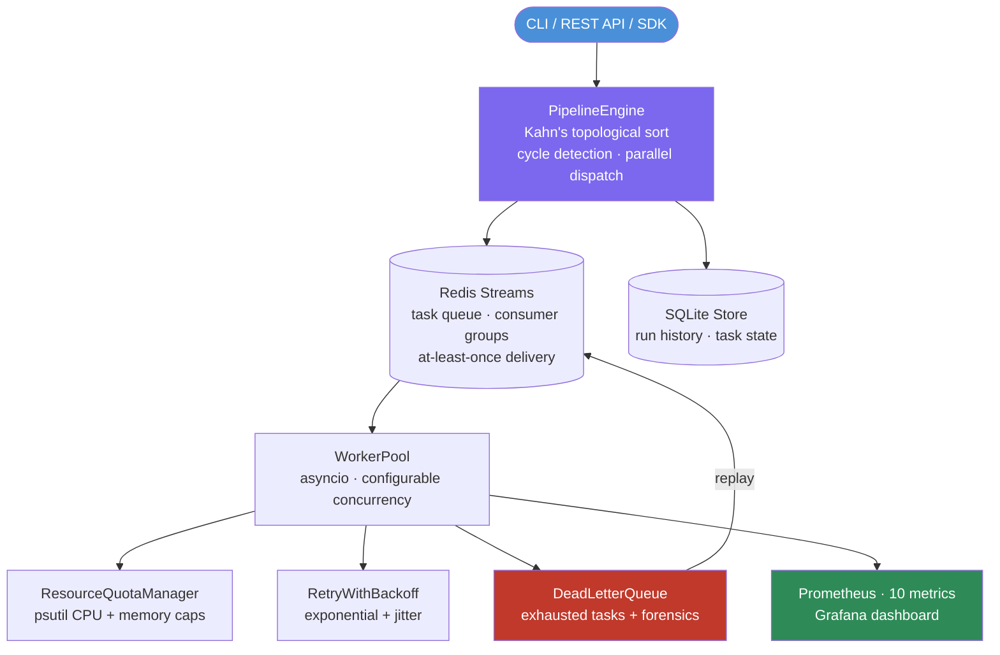
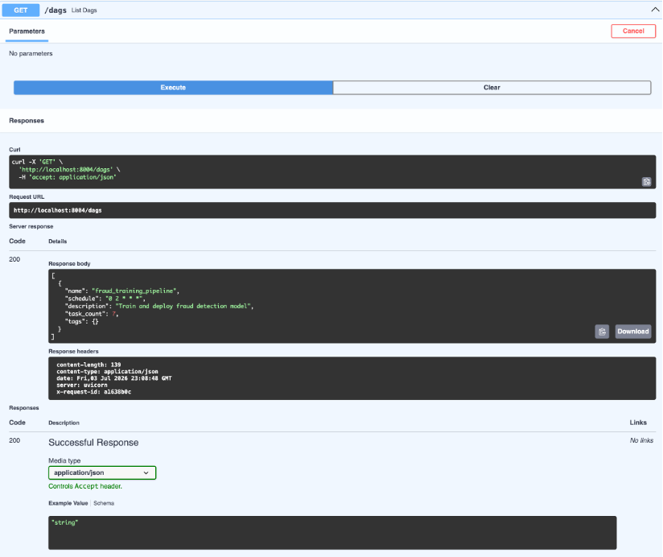
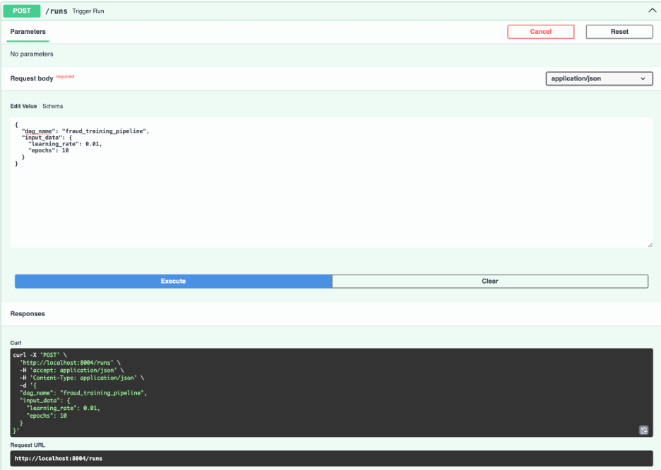
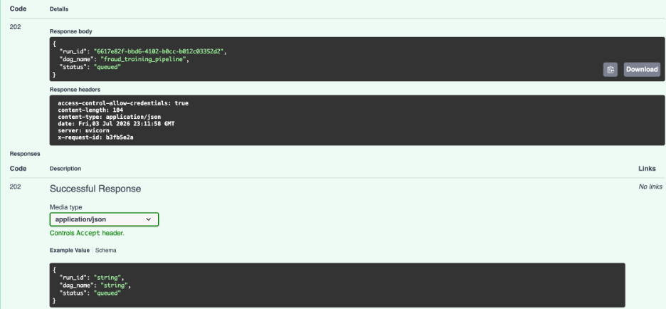
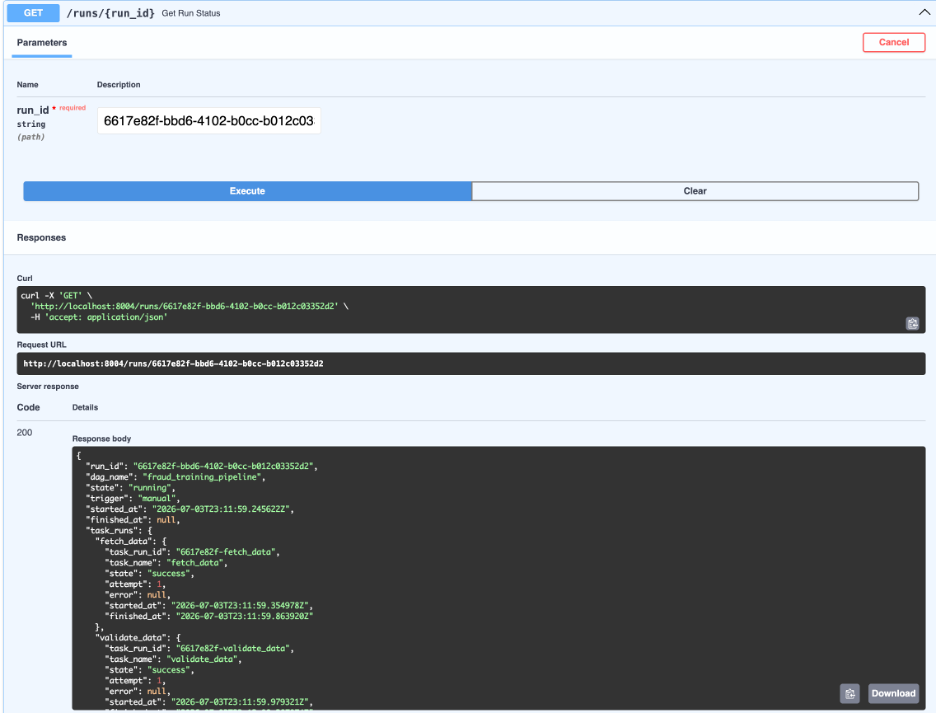
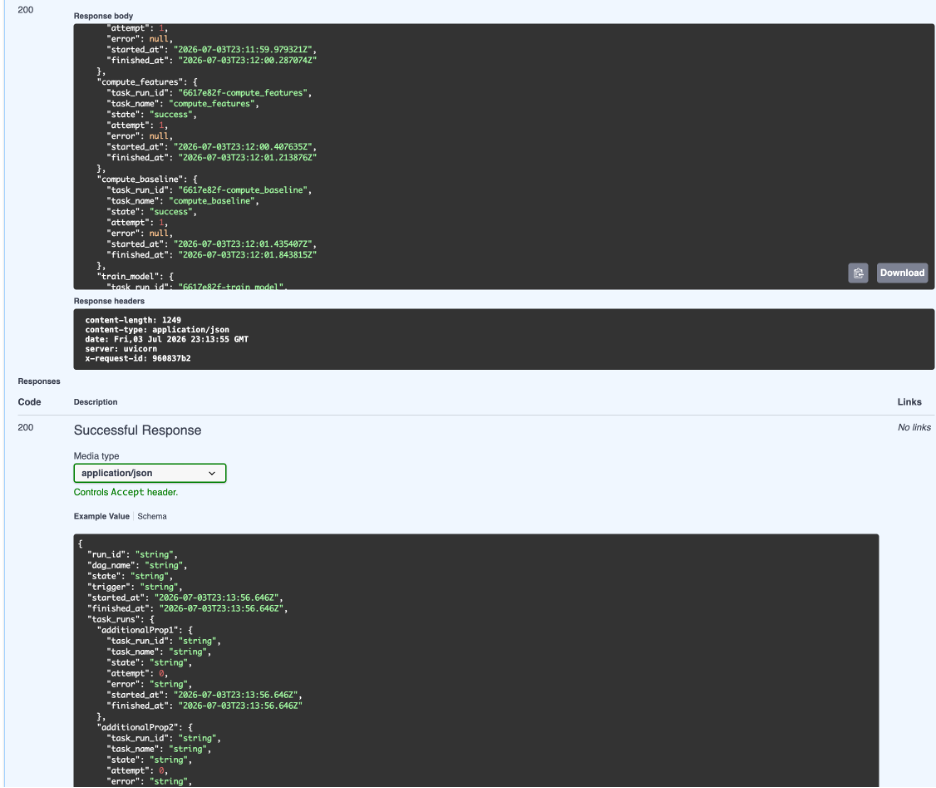
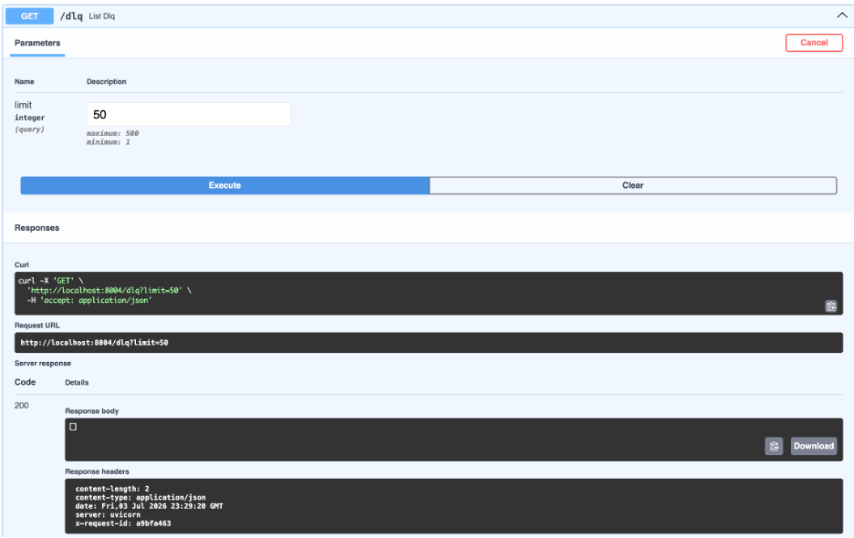
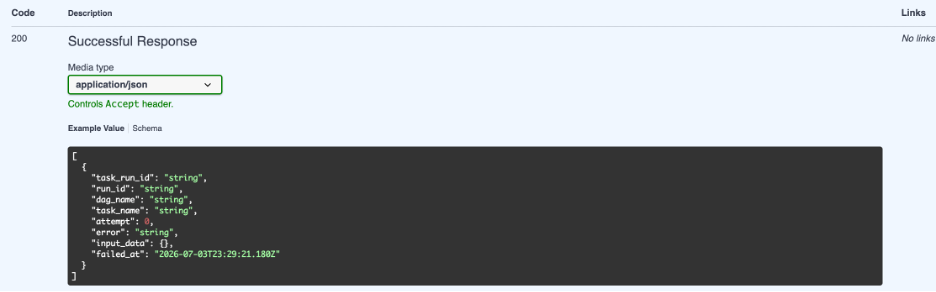

<p align="center">
  
</p>

<h1 align="center">Conduit</h1>

<p align="center">
  <strong>Event-Driven ML Pipeline Orchestrator</strong>
</p>

<p align="center">
  Lightweight DAG-based pipeline orchestration using Redis Streams.
  Airflow-style workflow execution without the operational overhead.
</p>

<p align="center">
  
  
  
  
  
</p>

---

## Overview

**Conduit** is a local-first ML pipeline orchestrator built around Python DAGs and Redis Streams. It lets you define workflows with a decorator-based DSL, execute tasks in dependency order, retry failed work, enforce resource quotas, and inspect failures through a dead letter queue.

The goal is to demonstrate the core engineering ideas behind production orchestrators such as Airflow, Prefect, and Dagster, but with a lightweight architecture that runs fully locally.

---

## Why It Matters

ML pipelines need more than simple scripts. Production workflows require:

* task dependency resolution
* retry handling for transient failures
* dead letter queues for permanent failures
* resource guards to prevent runaway jobs
* observability across DAG runs and task states
* repeatable execution from APIs, CLIs, or scheduled triggers

Conduit implements these patterns from scratch using Redis Streams as the event backbone and SQLite as the run-state store.

---

## Architecture



---

## Features

* **Python DAG DSL** with `@conduit.task` and `@conduit.dag`
* **Dependency resolver** using Kahn's topological sort with cycle detection
* **Parallel task dispatch** for independent tasks within the same stage
* **Redis Streams queue** with consumer groups and acknowledgement
* **At-least-once delivery semantics** for reliable task execution
* **Retries with exponential backoff and jitter**
* **Dead letter queue** with exception details, stack traces, attempts, and task metadata
* **DLQ replay** through CLI or REST API
* **Resource quota manager** using psutil-based CPU and memory caps
* **Cron scheduling** through APScheduler
* **Dynamic DAG support** for runtime-generated task graphs
* **FastAPI REST API** for triggering and inspecting DAG runs
* **Typer CLI** for local workflow control
* **Prometheus metrics** for tasks, runs, retries, DLQ depth, and worker utilization
* **Grafana dashboard** for monitoring pipeline execution

---

## Tech Stack

| Area       | Tools                  |
| ---------- | ---------------------- |
| DAG Engine | Python, asyncio        |
| API        | FastAPI                |
| Queue      | Redis Streams          |
| State      | SQLite                 |
| Scheduling | APScheduler            |
| CLI        | Typer                  |
| Metrics    | Prometheus             |
| Dashboard  | Grafana                |
| Runtime    | Docker, Docker Compose |

---

## Quickstart

### 1. Install dependencies

```bash
cd conduit
pip install -r requirements.txt
```

### 2. Start infrastructure

```bash
docker compose up redis prometheus grafana -d
```

### 3. Start Conduit

```bash
uvicorn conduit_api.main:app --port 8004 --reload
```

### 4. Run tests

```bash
pytest tests/ -v
```

### 5. Run the demo pipeline

```bash
python demo/ml_training_pipeline.py
```

### 6. Run the full Docker stack

```bash
docker compose up --build
```

Prometheus:

```text
http://localhost:9090
```

Grafana:

```text
http://localhost:3000
```

Default login:

```text
admin / conduit
```

---

## DAG Definition Example

```python
import conduit

@conduit.task(retries=3, retry_delay=5.0)
def fetch_data(run_id: str) -> dict:
    return {"rows": 1000}

@conduit.task(retries=2)
def preprocess(data: dict) -> dict:
    return {"features": data["rows"]}

@conduit.task
def train_model(features: dict) -> str:
    return "/models/v1.pkl"

@conduit.dag(schedule="0 2 * * *")
def ml_training_pipeline():
    data = fetch_data()
    features = preprocess(data)
    return train_model(features)
```

---

## CLI Usage

```bash
conduit dags
conduit run my_dag
conduit run my_dag --params '{"key": "val"}'
conduit status <run_id>
conduit list
conduit dlq
conduit dlq replay <task_run_id>
```

---

## REST API

| Method | Endpoint                    | Description                    |
| ------ | --------------------------- | ------------------------------ |
| POST   | `/runs`                     | Trigger a DAG run              |
| GET    | `/runs/{id}`                | Get run status and task states |
| GET    | `/runs`                     | List recent runs               |
| DELETE | `/runs/{id}`                | Cancel a run                   |
| GET    | `/dags`                     | List registered DAGs           |
| GET    | `/dlq`                      | List dead letter queue entries |
| POST   | `/dlq/{task_run_id}/replay` | Replay a failed task           |
| GET    | `/health`                   | Health check                   |
| GET    | `/metrics`                  | Prometheus metrics             |

---

## Observability

Conduit exposes Prometheus metrics at:

```text
http://localhost:8004/metrics
```

### Metrics

| Metric                                                   | Description                       |
| -------------------------------------------------------- | --------------------------------- |
| `conduit_tasks_submitted_total{dag_id, task_id}`         | Total tasks dispatched            |
| `conduit_tasks_completed_total{dag_id, task_id, status}` | Task completions by status        |
| `conduit_task_duration_seconds{dag_id, task_id}`         | Task execution latency            |
| `conduit_retries_total{dag_id, task_id}`                 | Retry events                      |
| `conduit_dlq_depth`                                      | Current dead letter queue size    |
| `conduit_workers_active`                                 | Active worker count               |
| `conduit_runs_total{dag_id, status}`                     | DAG run counts                    |
| `conduit_run_duration_seconds{dag_id}`                   | End-to-end pipeline duration      |
| `conduit_queue_depth`                                    | Pending Redis Streams queue depth |
| `conduit_resource_quota_rejections_total`                | Tasks rejected by quota manager   |

---

## Screenshots















---

## Tests

```bash
pytest tests/ -v
```

Run a specific test module:

```bash
pytest tests/test_pipeline_engine.py -v
```

With coverage:

```bash
pytest tests/ -v --cov=conduit_core --cov=conduit_api
```

The test suite covers DAG registration, topological sorting, cycle detection, retry logic, DLQ handling, resource quotas, and REST API endpoints.

---

## Demo

```bash
python demo/ml_training_pipeline.py
```

Expected flow:

```text
[conduit] DAG 'ml_training_pipeline' submitted — run_id: abc123
[conduit] Task 'fetch_data' → RUNNING
[conduit] Task 'fetch_data' → SUCCESS
[conduit] Task 'preprocess' → RUNNING
[conduit] Task 'preprocess' → SUCCESS
[conduit] Task 'train_model' → RUNNING
[conduit] Task 'train_model' → SUCCESS
[conduit] Pipeline completed
```

Inspect DLQ:

```bash
conduit dlq
```

Replay failed task:

```bash
conduit dlq replay <task_run_id>
```

---

## Known Limitations

* **Local resource quotas only**: CPU and memory caps use psutil and are process-level approximations.
* **Single-node execution**: Workers are asyncio coroutines, not distributed physical workers.
* **No DAG versioning**: Changing a DAG definition overwrites the previous version.
* **Redis required**: Redis Streams is the task queue backbone.
* **At-least-once delivery**: Tasks must be idempotent because retries may re-run partially completed work.
* **No web dashboard**: Operational visibility is provided through REST, CLI, Prometheus, and Grafana.

---

## Future Work

* Multi-machine workers through gRPC
* DAG versioning and rollback
* Web dashboard for pipeline visualization
* Per-task resource limits through Docker containers
* Sensor tasks for S3, webhooks, and time-window triggers
* YAML-based DAG import

